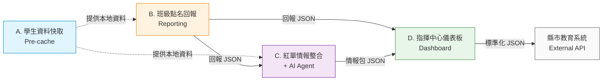
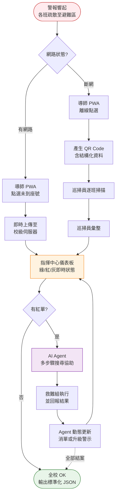
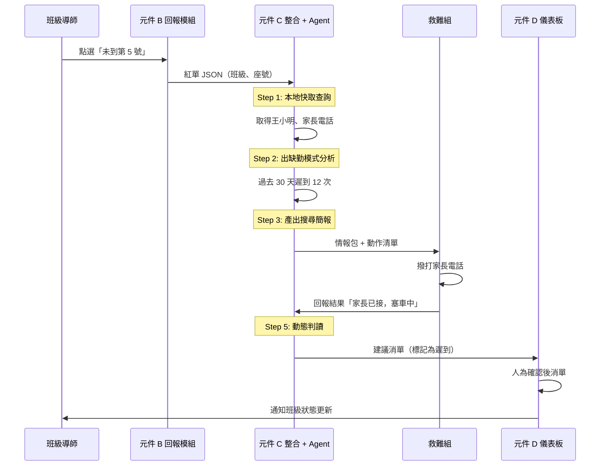

# Quick Roll｜校園災情通報積木元件

> 「**讓紙本紅綠單退場，讓救難組從查資料的人，變成執行決策的人。**」

本作品為 2026 年數位發展部「**防災積木元件創新賽：公民科技拼出韌性臺灣**」參賽作品。

---

## 一、問題背景

依據教育部規定，全國各級學校每年須辦理防災演練。然而現行流程存在以下未解問題：

- **實體依賴**：教師常忘攜紅綠單與筆
- **人力浪費**：每年動員 7 位以上組長收單，全校彙整需 10-15 分鐘
- **通訊塞車**：無線電同步使用時頻道擁擠
- **情報不整合**：紅單僅寫缺第 N 號，救難組仍需再查校務系統才能聯絡家長

**最常見的結果是：紅單找半天，發現學生只是遲到。**

但風險在於——若真的有學生失蹤而學校未即時掌握，所有累積的延遲都將成為搜救時效的代價。

---

## 二、解決方案

採「**離線優先、情報整合**」設計理念，提供一套在任何網路狀態下皆可運作之校園災情通報元件。

### 核心特色

| 特色 | 說明 |
|---|---|
| 🔌 **離線優先** | PWA + IndexedDB，斷網下仍可運作 |
| 🧱 **積木式設計** | 四個獨立子元件，可拆解使用 |
| 🤖 **AI Agent 協助** | 紅單自動補全情報、產出搜尋簡報 |
| 📊 **即時儀表板** | 三色狀態 + 自動統計 + 自動消單 |
| 🔗 **標準化輸出** | JSON Schema，可介接縣市教育系統 |

---

## 三、元件架構

### 整體資料流

### 元件對應使用者

| 元件 | 功能 | 主要使用者 |
|---|---|---|
| A | 災前將學生資料快取至本地 IndexedDB | 資訊組 |
| B | PWA 大畫面點選未到座號，連線/QR Code 雙模式 | 各班導師 |
| C | 自動帶出學生資料，AI Agent 多步驟搜尋協助 | 救難組 |
| D | 即時三色儀表板、自動統計、自動消單 | 教務主任/校長 |

### 雙模式運作（連線 / 斷網）

### AI Agent 多步驟流程

---

## 四、AI Agent 設計

AI Agent 介入於元件 C，採「**協助而非決策**」原則。

### 多步驟自主流程

1. **資料整合**：從本地快取查詢學生資料與歷史出缺勤統計
2. **模式判讀**：初判常態遲到 vs. 異常缺席傾向
3. **產出搜尋簡報**：給救難組可執行的動作清單
4. **接收動作回報**：救難組於 PWA 勾選結果
5. **動態調整建議**：依結果重新規劃下一步
6. **更新儀表板**：依救難組與指揮中心確認結果決定消單與否

**所有判讀僅為建議，最終決策權保留於救難組與指揮中心人員。**

### 風險與治理

- 不直接撥打電話、不直接發送訊息、不直接對外回報
- 紅單原始狀態始終保留，**消單需人為確認**
- 本地快取資料不對外連線、不外傳
- 限定結構化輸出格式，避免 AI 幻覺
- 斷網時可降級為規則式判斷，核心功能不受影響

---

## 五、預期效益

| 比較項目 | 現行作法 | 本作品 |
|---|---|---|
| 全校收單時間 | 10-15 分鐘 | 即時 / 離線 5 分鐘內 |
| 收單人力 | 7 位以上組長 | 0 人（連線）/ 1 人（離線）|
| 紅單背後資訊 | 僅座號，需再查校務系統 | 自動整合姓名、家長電話 |
| 進度可視性 | 紙本到才知道 | 儀表板即時顯示 |
| 上級回報 | 重新謄寫 | 一鍵匯出標準 JSON |

---

## 六、技術架構

- **前端**：Progressive Web App (PWA) + Service Worker + IndexedDB
- **後端**：Google Apps Script + Google Sheets
- **AI**：Anthropic Claude API（連線時）/ 規則式判斷（離線時）
- **資料交換**：JSON Schema
- **離線傳輸**：QR Code（zero-config、跨平台）

---

## 七、延伸可能

- **跨校彙整**：縣市教育處可即時掌握轄區內所有學校狀況
- **整合既有系統**：以 JSON Schema 介接校務系統、1Campus、防災平台
- **MCP Server 化**：包裝為 MCP Server，供 AI Agent（如 Claude Desktop）直接呼叫
- **多災種延伸**：點名邏輯可延伸至火災、複合災害、校外教學緊急應變

---

## 八、開發進度

| 階段 | 時程 | 內容 |
|---|---|---|
| 提案設計 | 即日 - 2026/6/1 | 完成提案、Persona、架構設計 |
| MVP 開發 | 2026/6/8 - 7/2 | PWA 前端、Apps Script 後端、AI Agent 整合 |
| 最終發表 | 2026/7/3 | 現場 Demo 與評審問答 |

---

## 九、授權

本專案採 [MIT License](LICENSE) 授權。

得獎後將依主辦單位規定，將完整原始碼以開源方式上架至指定平台。

---

> 「**這不是又一個資訊系統，而是重新設計這 15 分鐘。**」
